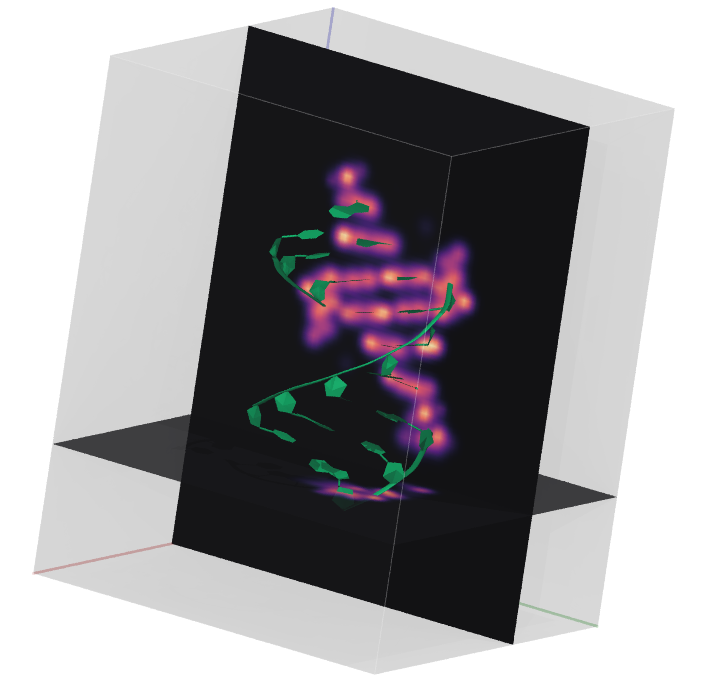
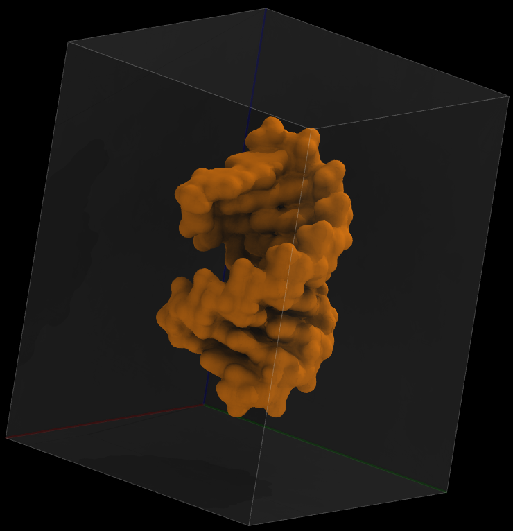
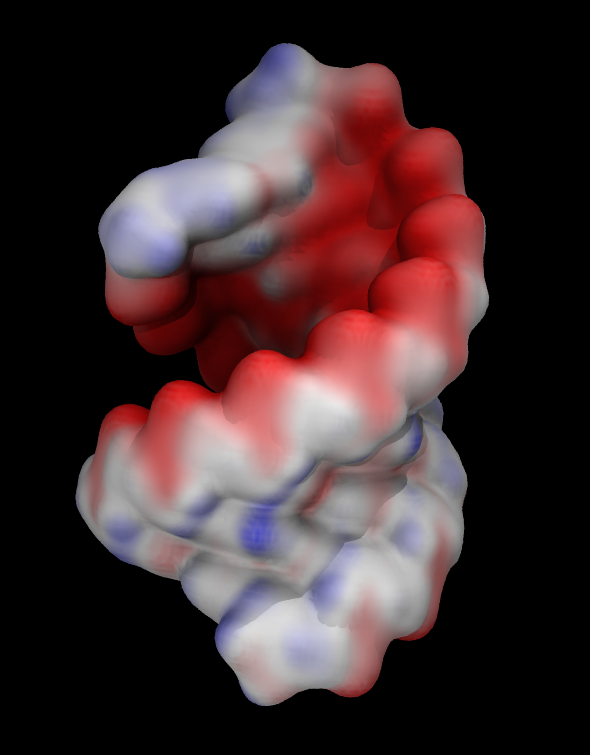

### Starting VMD
Open a terminal: 
`Applications` --> `System Tools` --> `Mate Terminal`
~~~
module load cuda vmd
vmd
~~~
{: .language-bash}

Three windows will open: 
- `VMD OpenGL Display`, display and interact with molecules
- `VMD Main`, work with molecules and trajectories, start interfaces and extensions 
- `VMD command window`, show info and run text commands

### Working with PDB files
As an example will be using X-ray crystallographic structure of human hemoglobin 1SI4.

####  Downloading files from Protein Data Bank
VMD can directly query PDB database.
{:width="400"}

Enter "1si4" and click `Load into new molecule in VMD`.  

{:width="400"}

Note: loading files from PDB is not possible from compute nodes on all clusters except Cedar because they are not connected to the Internet. Use the login nodes on these systems to load PDB files.

#### Opening a PDB file saved in your computer.

On a cluster you can download the example PDB file  using the following command:
~~~
wget https://files.rcsb.org/download/1si4.pdb
~~~
{: .language-bash}

If you are using VMD on your local computer you can navigate your browser to the URL above.

Once the file is downloaded, in the `VMD Main` window menu select `File` -> `New Molecule`. The `Molecule File Browser` window will open. Choose a molecule PDB file.

#### Understanding information about the loaded molecules
Load a second molecule (you can use the same pdb file).

VMD displays information about loaded molecules in its main window. This window dosplays: 
- molecule ID 
- molecule status
- molecule name 
- number of atoms
- number of trajectory frames
- volumetric data
- current frame

There are four components to molecular status:
- T (top). Top indicates the default molecule used in the `mol` text command. Top molecules can be referred to as `top` instead of their ID. Only one molecule can be top.
- A (active). Several commands such as `Animate` operate on all active molecules
- D (drawn)
- F (fixed)
  
Fix one of the molecules. Try using mouse to rotate/translate molecules.

### VMD command-line interface.
The VMD program can also be used in text mode. In text mode you interact with VMD using commands. The command-line interface is more flexible than GUI and it allows VMD to read commands from script files. With commands, you can use options than are not available in GUI, and you can run VMD non-interactively. Command-line access to VMD functions is very useful in HPC environment for batch jobs. The text mode is typically used for analyzing MD simulations and rendering animations.

In addition to commands, VMD offers the built-in TCL programming language. TCL interpreter available from the command-line allows you to write processing and visualization scripts utilizing any existing VMD functions and variables. 

Commands can be entered in two ways: 
- in the `VMD command window`  
- in `TCL console` available under the `Extensions` menu

VMD command window is very basic, you can only type commands, and it is not possible to edit command lines. TCL console offers history, autocompletion, and syntax highlighting.

#### Rotation
Let's run our first command.
~~~
rotate
~~~
{: .vmd}

~~~
rotate usage:
rotate stop -- stop current rotation
rotate [x | y | z] by <angle> -- rotate in one step
rotate [x | y | z] by <angle> <increment> -- smooth transition
~~~
{: .output}

If a command is entered without any argument, VMD displays short instructions on how to use it.

~~~
rotate x by 90 1
~~~
{: .vmd}

A smooth rotation of the scene around the x axis will be performed with an increment of 1 degree by this command. The advantage of using commands to rotate is that you can precisely specify the angle by which you want to rotate. For example to get a lateral view of a membrane system with membrane in x-y plane you would type `rotate x by 90` or `rotate y by 90`.

Try continuous rotation:
~~~
rock x by 1 180
rock off
~~~
{: .vmd}

#### Translation

$sel moveby {0 50 0}

#### Loops in VMD scripts

Let's write a simple `for` loop that animates zooming out.
A loop includes three statement:
- initialization of a loop variable
- termination condition
- increment

There statements are followed by a block of code that is executed repeatedly for each value of the loop variable.

~~~
for {set i 0} {$i < 200} {incr i} {scale by 0.99; display update}
~~~
{: .vmd}

#### Getting help on text commands
You can get help with text commands in several ways: 
1. This [link](https://www.ks.uiuc.edu/Research/vmd/vmd-1.9.4/ug/node121.html) provides a summary of basic text commands in VMD.  
2. You can find a detailed description of all commands, as well as their syntax in the online [VMD manual](https://www.ks.uiuc.edu/Research/vmd/current/ug/node117.html).  
3. Printing a command without any arguments displays a short version of help.

### Customizing VMD sessions
At startup VMD load a set of default options. You may find that they are not optimal for your work, and you need to change them every time you start a new visualization. Once you have changed settings to your liking you can make them permanent. 

#### Saving current settings 
Using the following steps, you can save current settings:
`Extensions`->`VMD Preferences` -> `Write setting to VMDRC`

#### VMD parameters that are often changed from their default values:

#### `Display rendermode GLSL` 
The GLSL mode turns on OpenGL extensions implementing programmable shading and transparency for higher quality molecular graphics. This mode renders faster and produces better images than "Normal" mode.

Load 6n4o.pdb file, and create a `NewCartoon` representation. Try rotating molecule and observe rendering speed. Is reasonable in `Normal` mode. 

Add `licorice` representation. Rendering is very slow now. 

Switch to GLSL mode. Performance is better now but still slow. It will improve if more CPUs are available, but the best of course is to use a GPU.  

#### `Display Projection orthographic` 
The orthographic projection allows us to get a better sense of the distance between objects and their relative sizes. The angle of view, distance, and focal length of a camera lens make lines of identical length appear different in perspective mode. Due to this, it is difficult to determine the relative size and dimensions of distant objects in perspective mode.

#### `Axes location off` 
In most cases you don't want axes to appear in figures prepared for publication.

####  `Display depthcue off` 
The use of depth cues can enhance perception of depth and distance. This is achieved by blending distant objects into the background color. Most of the time, it is not desirable and there are better alternatives.

#### `Display ambientocclusion on` and `Mol default material Diffuse`
These ray-tracing options enable photorealistic rendering. More about this later.

#### Managing VMDRC files
VMD preferences are saved in ~/.vmdrc file. VMD creates a very long file containing hundreds of all available settings, even the ones that are using global default values. You may find useful to create a short version of .vmdrc containing only settings that you want to change. A .vmdrc file is just a text file and it can easily be edited manually with any text editor. 

Let's open it. Settings are organized in sections. You don't want to change default colors, materials or menus. So you can safely delete these sections and leave only display parameters and molecular representations.

As an example, a .vmdrc file might look like this:
~~~   
      # VMD settings: file ~/.vmdrc

      # Turning-on of menus
      menu main on

      # Change display defaults
      display reposition 100 600
      display resize 672 682
      display projection Orthographic
      display depthcue off
      display rendermode GLSL
      display ambientocclusion on
      axes location Off
      color Display Background white

      # Default material
      mol default material Diffuse

      # Configure keyboard shortcuts
      user add key o {display projection orthographic} 
      user add key p {display projection perspective}
~~~
{: .file-content}

### Interacting with molecules
#### Obtaining good views for molecules
Rotate, zoom in/out, translate, and set rotation center to get a desired view. Pressing any of these keys switches the mode of interaction. For example, when `s` key is pressed mouse cursor will change. In this mode click, hold and move on a trackpad/mouse will zoom in/out.   
If you are lost simply press the `=` key to reset view.

| Action        | Hot keys 
----------------|---------
| Rotate        |     r      
| Zoom (Scale)  |     s                  
| Translate     |     t      
| Reset View    |     =      
| Set Center    |     c

#### Working with Graphical Representations  
##### Creating and modifying graphical representations
In the `Graphical representations` window you can
   - create representations using atom selections
   - choose drawing and coloring methods

- Navigate to `Graphics` --> `Representations` 
- Change `Drawing Method` to `New Cartoon`   
- Change `Coloring Method` to `Chain`  

- Try to get a better illumination by moving lights: `Mouse`->`Move Light`

{:width="400"}

- Changing draw style of a representation. Try `Draw style` --> `Tube`.
- Create a new representation and change its style to `QuickSurf`.
- Make it transparent by changing material to `GlassBubble` 
- Double click to turn representations on/off without deleting them. 
- Most useful draw styles: `NewCartoon`, `QuickSurf`, `Surf`, `Licorice`, `VDW`, `HBonds`

{:width="400"}

##### Selecting atoms 
In order to make a figure that is clear and impactful, it is useful to display different components of a system using different representations. Selecting groups of atoms is the key to achieving this.

- Selecting atoms, lots of selection options are available. 
- Most often used selection keywords are `noh`, `backbone`, `protein`, `nucleic`, `resname`, `resid`, `index`
- Selecting a residue: `residue` (starts from 0), `resid` (starts from 1)
- Selecting an atom: `index` (starts from 0), `serial` (starts from 1)
- Selecting hetero atoms: not (protein or nucleic or resname HOH)
- Limit selection to one monomer: not (protein or nucleic or resname HOH)
- Use logical operators (and, or, not) for complex selections
- Selecting atoms based on distance: 
   - `within 3 of serial 93` - selects all atoms located within 3 Angstrom of atom #93
   - `same residue as within 3 of serial 93` - selects whole residues if any atom is within 3 Angstrom of atom #93. 
- Selecting groups of atoms or residues
   - `residue 0 to 10, 14, 15, 20 to 30`
   
#### What selections are available in the loaded molecule?
 In `Graphical representations window` go to `Selections`-->`chain`. 
 VMD will display all chains present in the file (A,B,C,D).  
 Double click on keyword and value to select them.  

#### Measuring distances, angles, and dihedrals
Use hot keys to measure distances, angles and torsions.

| Action        | Hot keys   
----------------|---------
| Print info about atom | 0 
| Label atom        |      1
| Measure bond      |      2  
| Measure angle     |      3  
| Measure dihedral   |      4  

#### How to delete or hide Labels?
Labels can quickly clutter display. How to delete or hide Labels when you don't need them anymore?  
`Graphics` --> `Labels` --> `Delete`

>## Challenge
>Reproduce the following figure. In this image we see chain A of the pdb entry 1SI4 . The figure shows protein, residue HEM, atom FE, and HEM ligands (residues HIS, CYN). 
>
>{: width="480"}
> Use the following selection keywords: `chain`, `name`, `resname`, `same residue as within`. You will also need to use logical operators `and`, `not`. 
>>## Solution
>>select chain A  
>>`chain A` 
>>new cartoon, iceblue, aochalky  
>>
>>select HEM  
>>`chain A and resname HEM`  
>>licorice, colorid 3, aochalky  
>>
>>Select atom FE  
>>`chain A and name FE`  
>>VDW scale 0.4, colorid 1, aochalky  
>>
>>Select only FE ligands   
>>`not resname HEM and same residue as within 3 of name FE and chain A`  
>>licorice, colorid 4, aochalky  
>>
>>The previous command selected two FE ligands. How do we select only the small 2-atom FE ligand?  
>>Pick any atom from this molecule. All information about the atom will be printed in the VMD terminal window.
>>
>>select CYN    
>>`chain A and resname CYN`  
>>surf, colorid 4, aochalky  
>>  
>>- save your work:  `File`->`Save visualization state`.
>{: .solution}
{: .challenge}

#### Changing default colors
There are 1041 colors available in VMD, with color ids ranging from 0 to 1040. The first 33 are named colors. The remaining group of 1008 are colors used in the color map. There are no names for the specific colors in this group.

Each of the first 33 colors can be modified:
`Graphics`-->`Colors`-->`Color Definitions`

#### Saving your work
- Saving VMD scene: `File`->`Save visualization state`.  
- Restoring a visualization state: `File`->`Load visualization state`.

A VMD state file is a TCL script that contains all commands used in creating a visualization. You add new commands to a visualization script as you work on it, so it becomes longer and longer. When VMD scripts are executed, they go through all your steps. It is common for intermediary steps to be just trial commands that are not needed to recreate the final version. For example, you created and the deleted some representations, changes colors several times. 

In the future, you might want to reuse the visualization scene as a template for visualizing similar molecules. It is a good idea to inspect the visualization state file and keep only the commands necessary to recreate the final scene. In this way, it will remain clear and readable.

#### Get workshop example data
On training cluster:
~~~
cd ~/scratch
cp /tmp/workshop.tar.gz .
tar -xf workshop.tar.gz 
~~~
{: .language-bash}

On any other computer:
~~~
curl -OL https://github.com/ComputeCanada/molmodsim-amber-md-lesson/releases/download/workshop-2021-04/workshop.tar.gz
~~~
{: .language-bash}

#### Loading structure files
- More than 70 supported file types.
- File types are recognized by extension. If a file has a non-standard extension select format manually.

### Visualizing MD trajectories.
- First load a structure or a parameter file as a new molecule (for example AMBER7 Parm, XPLOR PSF, GROMACS GRO, PDB, ... ).   
- Then add a trajectory to the molecule: highlight the molecule, go to `File`->`Load Data into Molecule` and navigate to the trajectory file that you want to visualize).

It is best to use structure files that contain connectivity (topology, mol2) information whenever possible. In the absence of connectivity information, VMD uses distances between atoms to determine which ones are connected. It does not work perfectly all the time. Stretched bonds may go undetected, and there may be incorrect bonds formed between non-bonded atoms that clash. Your visualization will be ruined if you use the wrong bonds.

The automatic bond determination can be disabled when loading structure files:
~~~
wget https://files.rcsb.org/download/1si4.pdb
~~~
{: .language-bash}
~~~
mol new 1si4.pdb autobonds off
~~~
{: .vmd}

#### Load topology and trajectory files
~~~
cd ~/scratch/workshop/pdb/6N4O/simulation/sim_pmemd/4-production
ml vmd
vmd
~~~
{: .language-bash}

~~~
mol new prmtop_nowat.parm7
mol addfile mdcrd_nowat.nc
~~~
{: .vmd}

#### Viewing AMBER NETCDF-formatted trajectories on Windows and Mac.
- NETCDF trajectory files, which are AMBER's default format, can only be loaded on Linux. You can convert them to GROMACS XTC format by using the CPPTRAJ program from AMBER.

~~~
module load ambertools
cpptraj prmtop_nowat.parm7
~~~
{: .language-bash}
~~~
trajin mdcrd_nowat.nc
trajout mdcrd_nowat.xtc
go
~~~
{: .cpptraj}

#### Visualizing trajectories
- Interpolating coordinates to make trajectory animation run smoother:   
`Graphical representations`->`Trajectory`->`Trajectory Smoothing Window Size`    
- Visualizing periodic images:   
`Graphical representations`->`Periodic`  

### Photorealistic Rendering in VMD
As you may have noticed by now rendered images do not look realistic, they lack 3D feel, they look flat and it is impossible to see surface details clearly. For example, if you look at the real model of a protein with a cavity you'll see that the cavity is darker than the exposed outer surface, and becomes darker the deeper inside the cavity one goes.

To simulate such effects one needs to use ray-tracing technique called Ambient Occlusion. The ambient occlusion technique simulates the soft shadows that should naturally occur when indirect or ambient lighting is cast out onto your scene to make 3D objects look more realistic. Another technique helping to simulate a photorealistic image is Depth of Field focal blur.

Let's enable ambient occlusion and depth of field focal blur:

- `Display settings` --> `Ray-Tracing Options` and enable `Ambient Occlusion`, `Shading`, `DoF` 
- Change material to Diffuse or an AO-optimized material. 
- Use Tachyon, an AO-capable ray tracer.

VMD provides several implementations of Tachyon:
- Standalone Tachyon, supports rendering with both CPUs and GPUs.  
- Internal Tachyon using Intel OSPRay ray-tracing engine (CPU, AVX-accelerated). Best for Intel laptops with integrated graphics.
- Internal Tachyon using NVidia OptiX ray-tracing engine. For computers with NVidia GPUs.
- Interactive Tachyon OptiX allows to setup scene interactively before rendering the final image.
- Tachyon RTX Real Time Ray Tracing.  Best for computers with NVidia RTX GPUs (works also on NVidia GPUs without RTX cores).

#### Tachyon OptiX interactive ray tracer
- On Alliance systems available by loading `cuda` and `vmd/1.9.4a43` modules.
The interactive ray tracer opens a new graphical window in which you can preview ray-traced rendering and interact with it using a mouse. It allows only for a limited interactive functionality. You can rotate, scale, translate with a mouse, and you can turn on/off AO and DoF. It not a full-featured interactive implementation, but it is useful for improving the final rendered image.

Compare normal, glsl and OptiX rendering modes.

#### Real Time Ray Tracing
Real Time Ray Tracing solves limitations of the Tachyon OptiX interactive ray tracer by providing full-time ray-tracing in the main OpenGL VMD window. Real Time Ray Tracing using NVidia RTX cores is supported in version 1.9.4a55 of VMD on Linux platform.  

Installation:
~~~
# Configure where to install vmd
export VMDHOME=$HOME/scratch/VMD
# There is no need to change anything below this line 
export VMDINSTALLBINDIR=$VMDHOME/bin 
export VMDINSTALLLIBRARYDIR=$VMDHOME/lib 
wget https://www.ks.uiuc.edu/Research/vmd/vmd-1.9.4/files/alpha/vmd-1.9.4a55.bin.LINUXAMD64-CUDA102-OptiX650-OSPRay185-RTXRTRT.opengl.tar.gz
tar -xf vmd-1.9.4a55.bin.LINUXAMD64-CUDA102-OptiX650-OSPRay185-RTXRTRT.opengl.tar.gz
cd vmd-1.9.4a55 && ./configure 
cd src && make install
~~~
{: .language-bash}

Full-time ray tracing is available as a special rendering mode: `rendermode Tachyon RTX RTRT`

Pros:
- Enables quick creation of photorealistic animations.
- Greatly simplifies creation of impressive images allowing for an instant feedback. 

Cons:
- Not all representations are available.
- Coloring by volume is not available

#### Tachyon standalone (legacy)  
Despite the widespread use of hardware-accelerated Tachyon implementations today, the legacy standalone Tachyon implementation is still preferred in some cases. The standalone version of Tachyon provides greater control over ray-tracing than the built-in version. For example:
- You can improve the visual appeal of transparent surfaces by controlling the number of surfaces, for example (shown in Figure below). 
- The standalone Tachyon can also be used to render multiple trajectory frames in parallel to accelerate production of high-quality and high-definition animations.

|:-------------------------:|:-------------------------:|-------------------------:|
| {:width="400"} Snapshot  | {:width="400"} Tachyon, BlownGlass,  \-\-trans_max_surfaces 1| |

Standalone Tachyon can be installed using the following commands:
~~~
export INSTALLDIR=$HOME/bin
mkdir -p $INSTALLDIR
git clone https://github.com/thesketh/Tachyon
cd Tachyon/unix/
make linux-64-thr && ln -s ../compile/linux-64-thr/tachyon $INSTALLDIR
~~~
{: .language-bash}

- Check out [Publication Figure Rendering With Tachyon](https://www.ks.uiuc.edu/Research/vmd/minitutorials/tachyonao/) for more details.

### Visualizing Volumetric Data.
VMD has the ability to compute and display volumetric data. Volumetric data sets represent parameters whose values depend on their location in 3D, such as density, potential or solvent accessibility. Volumetric datasets store data as 3-D grids. Volumetric data can be visualized by VMD as slices, as isosurfaces, or by using volumetric data to color objects. Plugins for creating and analyzing volumetric data are also available in VMD.

#### Computing density maps 
Let's use the file workshop/bcl2-1.pdb

Load this file and compute density map using `Volmap Tool`:
1. Go to `Extensions`-->`Analysis`-->`Volmap Tool`
2. Change `selection` to `all` and `resolution` to `0.5`
3. Press `Create Map`

Our molecule now has one volumetric data set associated with it, and isosurface representation of this map is automatically created.

#### Visualizing volume slices
- select `VolumeSlice` in `Drawing Method`
- select `Volume` in `Coloring Method`
- select `Slice angle`-->`Y`

The color scale can be set in `Graphics`-->`Colors`--> `Color Scale`. Select `Sequential`-->`Plasma` in `Method`.

Play with the `Slice Offset` slider, which adjusts the y-coordinate of the slice. Different colors represent different numerical values of the volumetric data, in this case mass density. 

Make slices for the x- and z-directions as well, and rotate you view with the mouse so that all three planes are visible. 
{:width="480"}

#### Visualizing isosurfaces
For 3D way of representing the volumetric data follow the following steps:

Create a new representation using the `Isosurface` drawing method. 

In the Draw menu, select Solid Surface. 

Now, you can see a surface of constant volumetric value, chosen using the Isovalue slider. As you choose higher values, you see the surface shrinks down around a core where the most average mass was located. 

Select `isovalue 0.1`, and change material to `GlassBubble`. Then create another isosurface with `isovalue 2.2` and change its color.

{:width="480"}

#### Coloring 3D objects by volumetric data
Another common way to represent volumetric data is by coloring other representations based on it. For example you can color molecular surface by electrostatic potential.

As an example we will use electrostatic potential saved in file `bcl2-1_pot.dx`

To prepare potential file from the pdb file I first used [pdb2pqr web server](https://server.poissonboltzmann.org) to prepare pdb file with charges and radii needed for calculation of electrostatic potential. Then I used `APBS Electrostatics` VMD plugin to compute electrostatic potential around RNA molecule. I will discuss these calculations in detail later. For now we will simply use precomputed potential file as a visualization example. 

Delete the loaded molecule and load bcl2-1.pdb again. Then load data file bcl2-1_pot.dx into the molecule. 

Create `Surf` or `QuickSurf` representation.
Color it by volume
Adjust `Color scale data range` in the `Trajectory` tab. Try [-50 50]

{:width="360"}

https://github.com/OSC/bc_osc_vmd

wget https://gitlab.com/enTAP/EnTAP/-/archive/v0.10.8-beta/EnTAP-v0.10.8-beta.tar.gz
tar -xf EnTAP-v0.10.8-beta.tar.gz
cd EnTAP-v0.10.8-beta
ml gcc rsem diamond transdecoder interproscan
cmake CMakeLists.txt -DCMAKE_INSTALL_PREFIX=$HOME
make -j4 && make install


