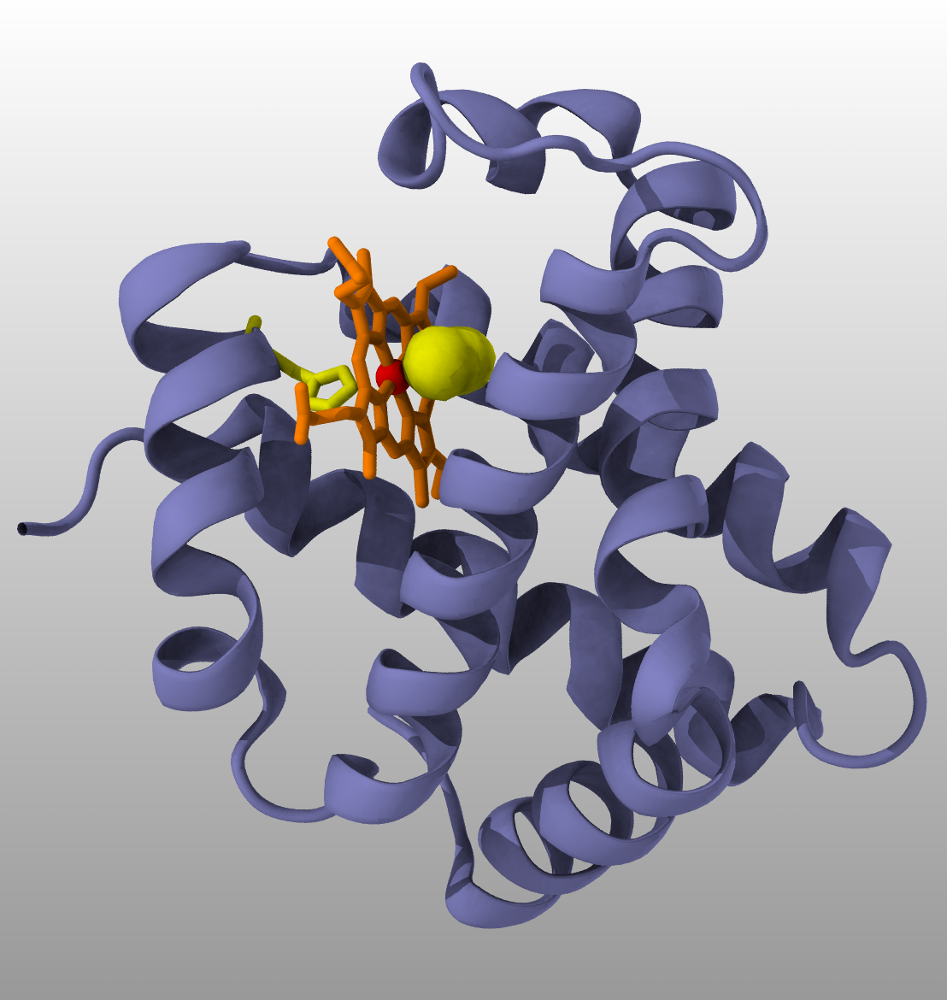

### Opening PDB files
We will be using X-ray crystallographic structure of human hemoglobin 1SI4.

####  Downloading files from Protein Data Bank
VMD can directly query PDB database.

Enter "1si4" and click `Load into new molecule in VMD`.  

{:width="400"}

#### Entering commands
Commands can be entered in the terminal window where you typed "vmd", or in `TC console` available in the `Extensions` tool bar. For description of all available commands see [Help on Tcl Text Commands](https://www.ks.uiuc.edu/Research/vmd/vmd-1.9.4/ug/node121.html)

You can use the command `pdbload` to download and open a PDB file:
~~~
mol pdbload 1si4
~~~
{: .vmd}

Note: loading files from PDB is not possible from compute nodes on Graham and Beluga because they are not connected to the Internet. Use the login nodes on these systems to load PDB files.

#### Opening a PDB file saved in your computer.
On the `VMD Main` window menu select `File` -> `New Molecule`. This will open the `Molecule File Browser`. Choose a molecule file.

### Interacting with molecules
#### Obtaining good views for molecules
You can rotate, zoom in/out, translate, and set rotation center to get a desired view.

| Action        | Hot keys   ||||||||||||||||||||||
----------------|---------
| Rotate        |     r      
| Zoom          |     s                  
| Translate     |     t      
| Reset View    |     =      
| Set Center    |     c

- Important Display parameters:
   - Rendermode
   - Projection

#### Working with Graphical Representations  
- Navigate to `Graphics`->`Representations`  
- Change `Drawing Method` to `New Cartoon`   
- Change `Coloring Method` to `Chain`  
- Try to get a better illumination by moving lights: `Mouse`->`Move Light`

{:width="400"}

- Create a representation
- Double click to turn representations on/off without deleting them
- Changing draw styles 
- Most useful draw styles: NewCartoon, QuickSurf, Surf, Licorice, VDW, HBonds
- Selectiong atoms, lots of keyword available. 
- Most often used selection keywords are noh, backbone, protein, nucleic, resname, resid, index

{:width="400"}

>## Challenge
>Reproduce the following figure
>
>{: width="480"}
>>## Solution
>>select chain A  
>>`chain A` 
>>new cartoon, iceblue, aochalky  
>>
>>select HEM  
>>`chain A and resname HEM`  
>>licorice, colorid 3, aochalky  
>>
>>Select atom FE  
>>`chain A and name FE`  
>>VDW scale 0.4, colorid 1, aochalky  
>>
>>Select only FE ligands   
>>`not resname HEM and same residue as within 3 of name FE and chain A`  
>>licorice, colorid 4, aochalky  
>>
>>The previous command selected two FE ligands. How do we select only the small 2-atom FE ligand?  
>>Pick any atom from this molecule. All information about the atom will be printed in the VMD terminal window.
>>
>>select CYN    
>>`chain A and resname CYN`  
>>surf, colorid 4, aochalky  
>{: .solution}
{: .challenge}

- Loading structure files
- Loading separate parameter and structure files.
- Saving your work

#### Measuring distances, angles, and dihedrals
You can measure distances, angles and torsions.

| Action        | Hot keys   |||||||||||||||||||||||
----------------|---------
| Select atom      |     1
| Select bond      |     2  
| Select angle     |     3  
| Select dihedral  |     4  

- Sequence viewer   
`Extensions`->`Analysis`->`Sequence viewer`   
Very useful to select groups of residues in the sequence and quickly visualize them

- Aligning structures
- Computing RMSD
- Making movies

#### Coloring by potential

~~~
module load StdEnv/2020 gcc vmd apbs
cd ~/home/svassili/scratch/workshop/pdb/6N4O/simulation/setup
cpptraj prmtop.parm7
~~~
{:.bash}

~~~
trajin inpcrd.rst7
strip !(:860-898)
trajout nucleic.pqr pdb dumpq
go
~~~

VMD
1. Load .pqr file
2. Reperesentation QuickSurf [0.5 0.5 0.5, max quality]
3. Extensions - Analysis - APBS - Run APBS
4. When prompted "Load ABBS into top molecule"
5. Select coloring method "Volume"
6. Adjust "Color scale data range" in the "Trajectory" tab. Try [-50 50]

#### References
[VMD Introductory tutorial](https://doi.org/10.1002/0471250953.bi0507s24)


