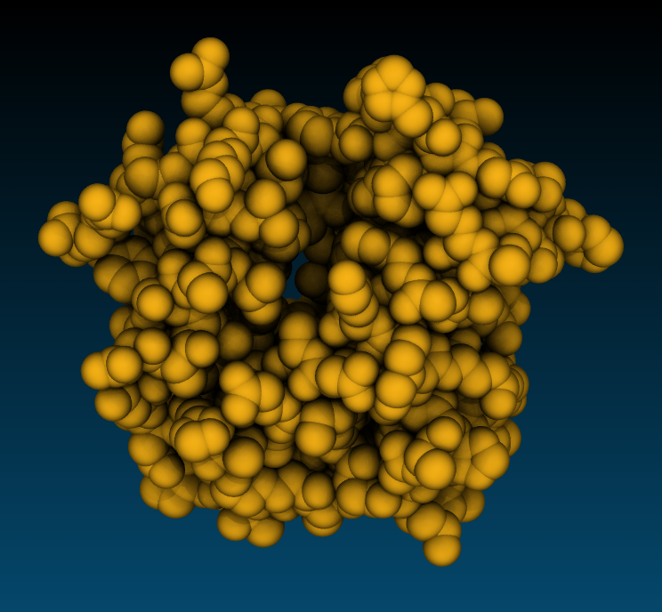
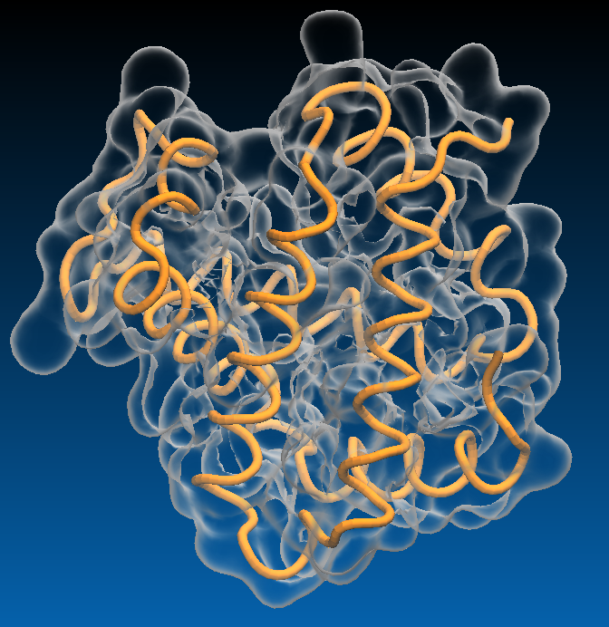

### Sequence Viewer   
`Extensions`->`Analysis`->`Sequence viewer`   
Very useful to select a residue or a group of residues in a sequence and quickly visualize them.

### RMSD Calculator    
`Extensions`->`Analysis`->`RMSD Calculator`   

>## Aligning Structures and calculating RMSD 
>1. Compute RMSD of two molecules: PDB ID 1si4 and 4n7n. Use only chain A backbone atoms for the calculation. 
>2. Why alignment fails when backbone of all chain A atoms is used for alignment? 
>3. Can you think of a way to include all common backbone atoms in the alignment? 
>
>>## Solution
>> 1. Use the atom selection: `chain A and resid 1 to 140`, and check box `Backbone only` for both alignment and RMSD calculation, RMSD = 0.92558
>> 2. The residue 141 of 1si4 molecule has the terminal oxygen atom "OXT", while it is absent in 4n7n.
>> 3. Exclude the OXT atom from the selection: `not name OXT and chain A and resid 1 to 141` 
>>
>{: .solution}
{: .challenge}

### RMSD Trajectory Tool
Time dependence of RMSD in a molecular dynamics simulation can ve computed using the RMSD Trajectory Tool.

~~~
cd /scratch/workshop/pdb/6N4O/simulation/sim_pmemd/4-production
~~~
{: .language-bash}

Use prmtop_nowat.parm7 and mdcrd_nowat.nc to plot RMSD along the trajectory. Check the `plot` box to plot RMSD.

### Movie Maker

The `Movie Maker` extension offers several types of animations. You can make a movie of rotation of rocking a static structure, or animate a trajectory with an optional viewpoint rocking. The available compression algorithm is also a very basic quality mpeg-2 encoder optimized for speed on a single computer.  

With a custom animation script you have full control of camera movements and special effects such as adding glow lights to some atoms, drawing geometrical figures, dynamic slicing volume data, etc. 

Much better image rendering can be done in a reasonable time on an HPC cluster. Typically you would use VMD to write scene description files of every trajectory frame for subsequent rendering with a ray tracing engine such as Tachyon.Then you would submit a script for rendering multiple frames in parallel on hundreds of CPU's. Then you would encode all frames in a movie with ffmpeg. Much better compression algorithms such as H.265/HEVC or Google VP9 with much higher quality settings can be used to encode an animation with `ffmpeg`.

~~~
module load StdEnv/2020 gcc vmd ffmpeg
vmd
~~~
{: .language-bash}

- `Extensions` -> `Visualization` -> `Movie Maker`
- `Movie settings` -> `Rotation about Y axis`
- `Format` -> `MPEG2(ffmpeg)`
- Optionally `Set working directory` 
- In the `Movie durations (seconds)` box enter 10
- Press `Make movie`

### APBS electrostatics
Surfaces, isosurfaces, and other representations can be colored by electrostatic potential. Any other volumetric properties such as density can be also used for coloring. Electrostatic potential calculations in VMD are done with APBS - Adaptive Poisson-Boltzmann Solver. APBS solves the equations of continuum electrostatics for biomolecular systems. This program must be made available to VMD by loading the `apbs` module. Below are the commands to make .pqr file from AMBER topology and restart files. These files are available in the workshop data. We will go though all the steps of system preparation later. 

APBS requires a PDB file with atomic partial charges and radii as an input. Such file can be easily prepared from a simulation topology file. 

~~~
module load StdEnv/2020 gcc vmd apbs ambertools
source $EBROOTAMBERTOOLS/amber.sh
cd ~/scratch/workshop/pdb/6N4O/simulation/setup
cpptraj prmtop.parm7
~~~
{: .language-bash}

~~~
trajin inpcrd.rst7
strip !(:860-898)
trajout nucleic.pqr pdb dumpq
go
~~~
{: .cpptraj}

VMD
1. Load .pqr file
2. Reperesentation Surf or QuickSurf 
3. `Extensions` -> `Analysis` -> `APBS electrostatics` ->  `Run APBS`
4. When prompted `Load ABBS into top molecule`
5. Select coloring method `Volume`
6. Adjust `Color scale data range` in the `Trajectory` tab. Try [-50 50]

#### Higher quality rendering
VMD is designed to generate images very fast to maximize interactivity, so in interactive mode rendering is optimized for speed and VMD does not use computationally intensive  photorealistic rendering techniques. If you want a very high definition picture, or a picture with photorealistic rendering of shadows or transparent surfaces you need to use a ray tracing engine. Instead of producing high quality images directly, VMD writes scene description files which can be used as input to several ray tracing programs. In this tutorial, you will learn how to make an image using Tachyon ray-tracing engine through VMD’s graphical interface. VMD ships with Tachyon for producing high quality images.

Because Tachyon simulates light interaction with virtual objects, it handles shadows realistically, and representations that have crevices appear to have three-dimensional depth.

The most important Display settings enabling ray tracing are `Shadows` and `Amb. Occl.`. They both should be turned on. Materials suitable for Tachyon are diffuse, AoChalky, AoShiny, AoEdgy. 

|-----------------------------|-------------------------|---------------------------------------|
|:---------------------------:|:-----------------------:|:-------------------------------------:|
|  Snapshot    |  Tachyon, AoChalky |  Tachyon, AoEdgy  |
|  Snapshot    |  Tachyon, BlownGlass, trans_max_surfaces 1| |

Compile and install Tachyon
~~~
cd ~
mkdir bin
wget http://jedi.ks.uiuc.edu/~johns/raytracer/files/0.99b6/tachyon-0.99b6.tar.gz
tar -xf tachyon-0.99b6.tar.gz
cd tachyon/unix
make linux-64-thr
ln -s ~/tachyon/compile/linux-64-thr/tachyon ~/bin/tachyon
echo 'PATH=$PATH:$HOME/bin' >> $HOME/.bashrc
~~~
{: .language-bash}

### References
[VMD Introductory tutorial](https://doi.org/10.1002/0471250953.bi0507s24)


