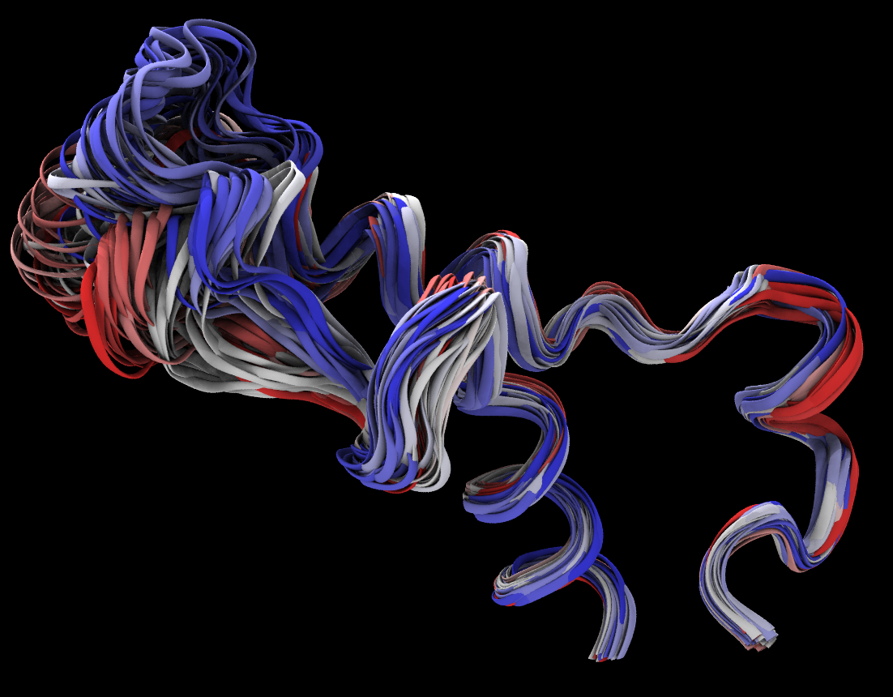

### Get workshop example data
On the training cluster:
~~~
cd ~/scratch
cp /tmp/workshop.tar.gz .
tar -xf workshop.tar.gz 
~~~
{: .language-bash}

On any other computer:
~~~
curl -OL https://github.com/ComputeCanada/molmodsim-amber-md-lesson/releases/download/workshop-2021-04/workshop.tar.gz
~~~
{: .language-bash}

### Loading trajectory files
A trajectory file contains the coordinates for all atoms over the course of a simulation. Normally, not every time step of the simulation is saved, since it would create a huge file. It is common to save coordinates every 1000 to 5000 steps. All of these coordinates allow us to measure the dynamic properties of our simulation experiments, including secondary-structure evolution, diffusion constants, correlations between groups, etc

#### Loading structure files
To load a trajectory, we need both the structure and the trajectory file. 
First load a structure file as a new molecule. VMD can read structure files in different formats, such as AMBER7 Parm, XPLOR PSF, GROMACS GRO, PDB, etc.). File types are recognized by extension. If a file has a non-standard extension you can select format manually.

It is best to use structure files that contain connectivity (topology, mol2) information whenever possible. In the absence of connectivity information, VMD uses distances between atoms to determine which ones are connected. It does not work perfectly all the time. Stretched bonds may go undetected, and there may be incorrect bonds formed between non-bonded atoms that clash. If you use the wrong bonds, your visualization will be incorrect. The automatic bond determination can be disabled when loading structure files:

~~~
mol new 1si4.pdb autobonds off
~~~
{: .vmd}

Our training dataset is located in the directory `workshop/pdb/6N4O/simulation/sim_pmemd/4-production`. As a structure file we will be using AMBER7 parameter file `prmtop_nowat.parm7`. Change into this directory and load the topology file.

Once a molecular structure has been loaded you can add a trajectory to it: highlight the molecule, go to `File`->`Load Data into Molecule` and choose `mdcrd_nowat.xtc`. It is a long trajectory with 3000 frames. To make loading faster you can load every 5th frame.

>## Loading trajectory using commands on the training cluster
>~~~
>cd ~/scratch/workshop/pdb/6N4O/simulation/sim_pmemd/4-production
>module load vmd
>vmd
>~~~
>{: .language-bash}
>~~~
>mol new prmtop_nowat.parm7
>mol addfile mdcrd_nowat.xtc step 5
>~~~
>{: .vmd}
{: .callout}

>## Viewing AMBER-NetCDF trajectories on Windows and MAC.
> NetCDF trajectory files, which are AMBER's default format, can only be loaded on Linux. You can convert them to GROMACS XTC format by using the CPPTRAJ program from AMBER.
>
>~~~
>module load ambertools
>cpptraj prmtop_nowat.parm7
>~~~
>{: .language-bash}
>~~~
>trajin mdcrd_nowat.nc
>trajout mdcrd_nowat.xtc
>go
>~~~
>{: .cpptraj}
{: .callout}
#### Visualizing trajectories
- To make trajectory animation run smoother you can interpolate coordinates:   
`Graphical representations`->`Trajectory`->`Trajectory Smoothing Window Size`    
- You can also visualize periodic images:   
`Graphical representations`->`Periodic`  
-  You can visualize multiple frames and color them by trajectory step. Try resid 809 to 859.
{:width="480"}

### RMSD Trajectory Analysis
The RMSD is a numerical measurement of the difference between two structures: a target structure and a reference structure. Our interest in molecular dynamics is in how structures and parts of structures change over time. For example, a plot of RMSD vs. time will reveal the opening and closing of gates on a protein, such as a transporter. When compared with the starting point, the RMSD can identify protein structure changes and study stability of the simulated system. As the RMSD curve flattens or levels off, that can be a sign that the system has equilibrated.

You can calculate the time dependence of RMSD in a molecular dynamics simulation using the RMSD Trajectory Tool. It is located under `Extensions` -> `Analysis` -> `RMSD Trajectory Tool`

1. Load a trajectory
2. Start `RMSD Trajectory Tool` and add a molecule: `Add active`
3. `Align` all frames using backbone of the whole protein. You can choose a reference frame or a reference molecule.
4. Make a selection of atoms for which you want to calculate RMSD
    - use all protein backbone atoms (normally you don't want to include hydrogens)
    - use all nucleic acid atoms
    - use a specific part ot the system (e.g. resid 20 to 80)
5. You can optionally save rmsd in a file so you can make a nice figure with your favorite plotting software, and check `Plot` box to view the result.
 

>## Exercise
> Align frames using backbone of all protein residues. Compute RMSD of two selections: backbone atoms of residues 780-800 and 820-840.  
>
> 1. Considering both selections, what is the minimum and the maximum RMSD?
> 2. How does the RMSD change when you include all atoms?
> 3. Over the course of the simulation, which of the groups is more stable? 
> 4. Are your RMSD results affected by the previous superposition step?
>
>> ## Solution
>> 1. The minimum is 0.339, the maximum is 6.259.
>> 2. RMSD increases when all atoms are considered.
>> 3. The first group, 780-800.
>> 4. Yes
>> {: .language-bash}
> {: .solution}
{: .challenge}

### RMSD Calculator    
The `RMSD calculator` is similar to the `RMSD Trajectory Tool`, but it calculates the RMSD between two molecules. It is located under `Extensions`->`Analysis`->`RMSD Calculator`.   
>## Exercise: Calculating RMSD between molecules 
>The RMSD calculator works well when two molecules are composed of the same atoms, but  the alignment will fail if atom selection in the reference molecule differs from that in the target molecule. The issue is illustrated in this exercise.
>1. Compute RMSD of two molecules: PDB ID 1si4 and 4n7n. For the calculation, use only chain A backbone atoms.
>2. When all chain A residues are used for alignment, why does the alignment fail?
>3. Can you think of a way to include all backbone atoms present in both proteins in the alignment? 
>
>>## Solution
>> 1. Use the atom selection: `chain A and resid 1 to 140`, and check box `Backbone only` for both alignment and RMSD calculation, RMSD = 0.92558
>> 2. The residue 141 of 1si4 molecule has the terminal oxygen atom "OXT", while it is absent in 4n7n.
>> 3. Exclude the OXT atom from the selection: `not name OXT and chain A and resid 1 to 141` 
>>
>{: .solution}
{: .challenge}



