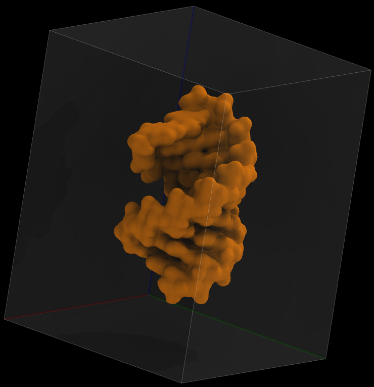
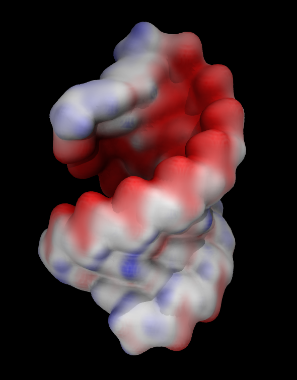

### Visual representations of volumetric data
VMD has the ability to compute and display volumetric data. Volumetric data sets represent parameters whose values depend on their location in 3D, such as density, potential or solvent accessibility. Volumetric datasets store data as 3-D grids. Volumetric data can be visualized by VMD as slices, as isosurfaces, or by using volumetric data to color objects. Plugins for creating and analyzing volumetric data are also available in VMD.

### Creating density maps 
Let's use the file workshop/pqr/bcl2-1.pdb

Load this file and compute density map using `Volmap Tool`:
1. Go to `Extensions`-->`Analysis`-->`Volmap Tool`
2. Change `selection` to `all` and `resolution` to `0.5`
3. Press `Create Map`

Our molecule now has one volumetric data set associated with it, and isosurface representation of this map is automatically created.

### Using slices to visualize volume
- select `VolumeSlice` in `Drawing Method`
- select `Volume` in `Coloring Method`
- select `Slice angle`-->`Y`

The color scale can be set in `Graphics`-->`Colors`--> `Color Scale`. Select `Sequential`-->`Plasma` in `Method`.

Play with the `Slice Offset` slider, which adjusts the y-coordinate of the slice. Different colors represent different numerical values of the volumetric data, in this case mass density. 

Make slices for the x- and z-directions as well, and rotate you view with the mouse so that all three planes are visible. 
{:width="480"}

### Using isosurfaces to visualize volume
For 3D surface representation of the volumetric data follow the following steps:

Create a new representation using the `Isosurface` drawing method. 

In the Draw menu, select `Solid Surface`. 

Now, you can see a surface of constant volumetric value, chosen using the Isovalue slider. As you choose higher values, you see the surface shrinks down around a core where the most average mass was located. 

Select `isovalue 0.1`, and change material to `GlassBubble`. Then create another isosurface with `isovalue 2.2` and change its color.

{:width="480"}

### Coloring objects by volumetric data
Another common way to represent volumetric data is by coloring other representations based on it. For example you can color molecular surface by electrostatic potential.

- As an example we will use electrostatic potential saved in file `workshop/pqr/bcl2-1_pot.dx`

To prepare potential file from the pdb file I first used [pdb2pqr](https://server.poissonboltzmann.org) web server to prepare pdb file with charges and radii needed for calculation of electrostatic potential. Then I used `APBS Electrostatics` VMD plugin to compute electrostatic potential around RNA molecule. I will discuss these calculations in detail later. For now we will simply use precomputed potential file as a visualization example. 

- Delete the loaded molecule and load bcl2-1.pdb again. Then load data file bcl2-1_pot.dx into the molecule. 
- Create `Surf` or `QuickSurf` representation.
- Color it by volume
- Adjust `Color scale data range` in the `Trajectory` tab. Try [-50 50].

{:width="360"}

### Visualizing electron density maps

The electron density map represents the fit between the structural model  and experimental data from an X-ray structure determination. Scientists commonly use 2fo-fc and fo-fc electron density maps.  The fo-fc  map shows only the electron density poorly represented by the model, while the 2fo-fc map includes electron density around the model. We will be using the 2fo-fc map for this demonstration. 

Electron density maps calculated using the program DCC can be downloaded in DSN6 format from Structure Summary pages.

Example PDB file is 7xcq. 
- Download two files:
    - [7xcq.pdb](https://files.rcsb.org/download/7xcq.pdb) and
    - [7xcq_2fo-fc.dsn6 Map (DSN6)](https://edmaps.rcsb.org/maps/7xcq_2fofc.dsn6). 

- Load 7xcq.pdb and then load 7xcq_2fo-fc.dsn6 map into the 7xcq molecule.
- Create isosurface representation and set the isovalue to 1.0.

The volume map is too big, so the figure is very busy. By focusing on a small area of interest, visualization can be significantly improved. When choosing regions of interest in volumetric data, VMD provides two options.

|------------------------|-------------------|-------------------|
|:----------------------:|:-----------------:|:-----------------:|
|  Whole Map |  Clipping planes |  Volime Tool | 

#### Clip Tool
Clipping planes allow for the slicing of a 3D model along a plane. Each molecule can have up to 6 different clipping planes, which can independently be set on or off. 

- To get a clear view, use clipping planes to remove volume in front of and behind your region of interest. `Clipping Plane Tool` is under `Extensions`->`Visualization`.  
- Check `Normal follows view` box to orient clipping planes perpendicular to the view direction.  

Let's focus on the HEM. The first step is to orient it in the plane of the screen. Then in the clipping plane tool check the box `Normal follows view` and activate two clipping planes. Uncheck `Normal follows view`, rotate the molecule to look at the HEM from its side and adjust positions of the clipping planes.

#### Volume Tool
[Volume Tool](https://www.ks.uiuc.edu/Research/vmd/vmd-1.9.4/ug/node158.html) 
provides many functions for working with volume maps. The "mask" function removes all voxels from an input map that fall outside the given cutoff from a set of atoms. This functionality is available only in VMD command line. 

~~~
voltool mask <selection> -mol <molID> -vol <volID> -cutoff <cutoff distance>
~~~
{: .vmd}

The voltool operates on selections of atoms, so we need to create a selection. You can make selections by creating a graphical representation. Let's make a representation showing HEM (resname HEM). 

How do we use this representation in the command?
~~~
atomselect list
~~~
{: .vmd}
Will print all available selections.

You may have more than one selection, so let's confirm that atomselect0 is the selection we want:
~~~
atomselect0 text
~~~
{: .vmd}
Will print the selection text.

As you might imagine, the atomselect command can also make selections. We'll learn how to make selections with this command later. For now let's just use the selection we already have.  
~~~
voltool mask atomselect0 -mol 1
~~~
{: .vmd}
>## Selecting an area of interest with voltool
>Visualize electron density around TYR103, or any other residue using voltool.
>
{: .challenge}

