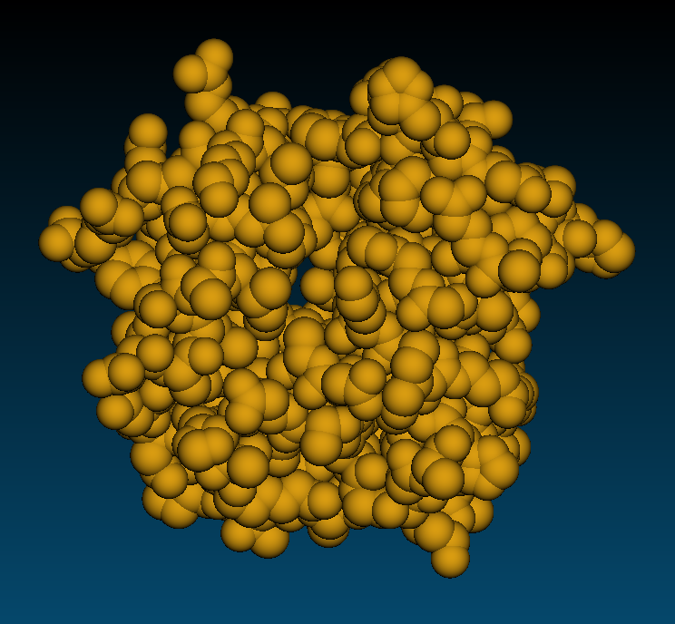
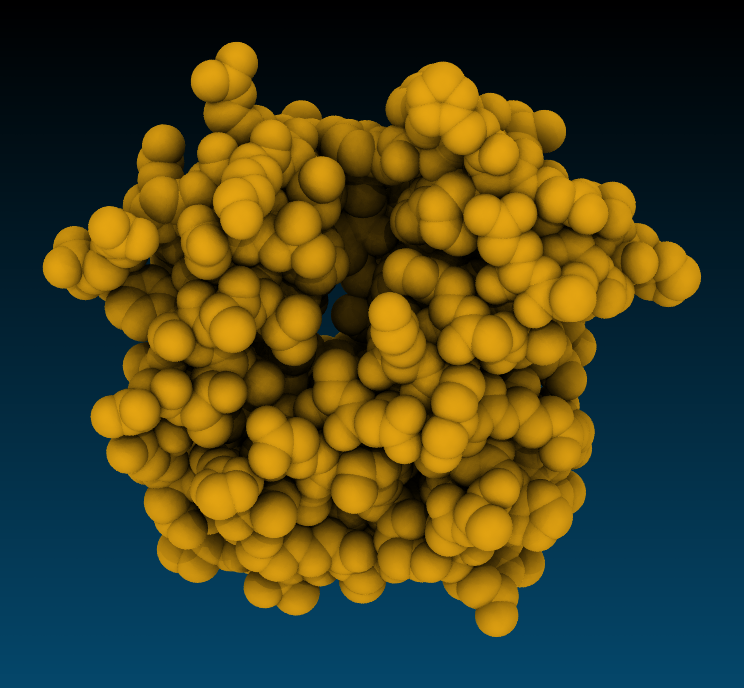
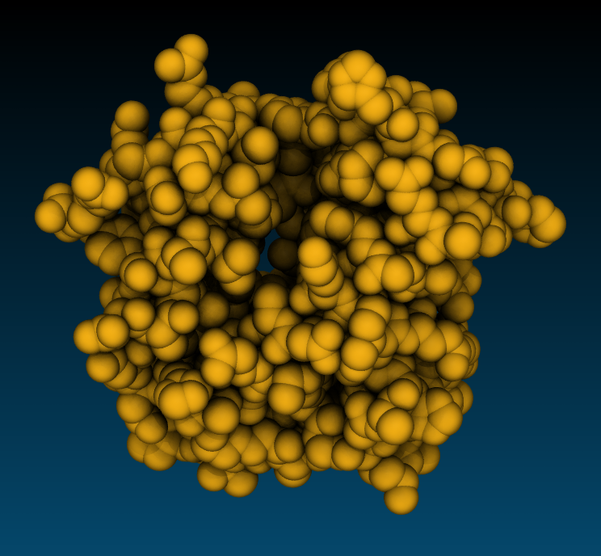
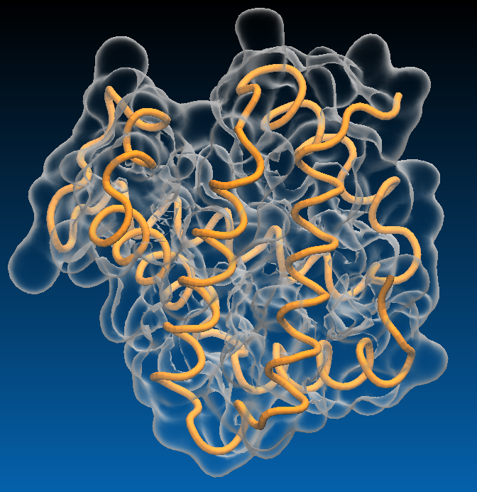
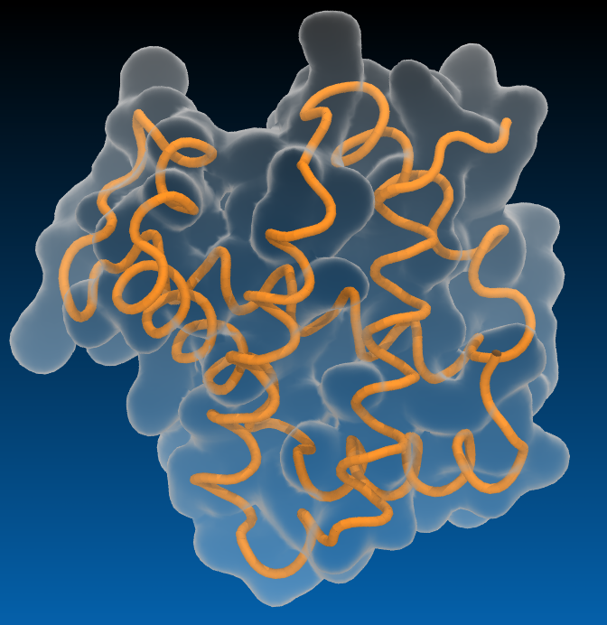

### How to make 3D objects look more realistic?
VMD is designed to generate images very fast to maximize interactivity, so in rendering in graphical window is optimized for speed. As you may have noticed by now rendered images do not look realistic, they lack 3D feel, they look flat and it is impossible to see surface profile clearly. For example, if you look at the real model of a protein with a cavity you'll see that the cavity is darker than the exposed outer surface, and becomes darker the deeper inside the cavity one goes.
{: .instructor_notes}
 
To simulate such effects one needs to use ray-tracing technique called `Ambient Occlusion`. The ambient occlusion technique simulates the soft shadows that should naturally occur when indirect or ambient lighting is cast out onto your scene to make 3D objects look more realistic. Another technique helping to simulate a photorealistic image is `Depth of Field` focal blur.
{: .instructor_notes}

- The ambient occlusion technique simulates realistic lightning
{: .self_study_text}

These features are not enabled by default. Let's enable ambient occlusion and depth of field focal blur:

- `Display settings` --> `Ray-Tracing Options` and enable `Ambient Occlusion`, `Shading`, `DoF` 
- You also need to change material to `Diffuse` or one of the AO-optimized materials (`AoChalky`, `AoShiny`, or `AoEdgy`). These materials are optimal for rendering with ambient occlusion model. 
- Finally, use Tachyon a ray-tracing engine that is capable of handling ambient occlusion. 

|-----------------------------|-------------------------|---------------------------------------|
|:---------------------------:|:-----------------------:|:-------------------------------------:|
|  Snapshot  |  Tachyon, AoChalky |  Tachyon, AoEdgy  |

### Tachyon flavours
VMD provides several implementations of Tachyon:
- Standalone Tachyon, supports rendering with both CPUs and GPUs.  
- Internal Tachyon using Intel OSPRay ray-tracing engine (CPU, AVX-accelerated). Best for Intel laptops with integrated graphics.
- Internal Tachyon using NVidia OptiX ray-tracing engine. For computers with NVidia GPUs.
- Interactive Tachyon OptiX allows to setup scene interactively before rendering the final image.
- Tachyon RTX Real Time Ray Tracing.  Best for computers with NVidia RTX GPUs (works also on NVidia GPUs without RTX cores).

#### Tachyon OptiX and Tachyon OSPRay interactive ray tracers
Nvidia OptiX and Intel OSPRay are hardware-accelerated ray tracers capable of interactively rendering photorealistic global illumination. On Alliance systems Tachyon OptiX is available by loading `cuda` and `vmd/1.9.4a43` modules. The interactive ray tracer opens a new graphical window in which you can preview ray-traced rendering and interact with it using a mouse. When you close the interactive window the final image is saved in file. It allows only for a limited interactive functionality. You can rotate, scale, translate with a mouse, and you can turn on/off AO and DoF. It not a full-featured interactive implementation, but it is useful for improving the final rendered image.
{: .instructor_notes}

Compare normal, glsl and OptiX rendering modes.

#### Real Time Ray Tracing (RTX-RTRT)
Real Time Ray Tracing solves limitations of the Tachyon OptiX interactive ray tracer by providing full-time ray-tracing in the main OpenGL VMD window. 
{: .instructor_notes}

Real Time Ray Tracing using NVidia RTX cores is supported in version 1.9.4a55 of VMD on Linux platform.  

Installation (works on gra-vdi, siku):
~~~
# Configure where to install vmd
export VMDHOME=$HOME/scratch/VMD
# There is no need to change anything below this line 
export VMDINSTALLBINDIR=$VMDHOME/bin 
export VMDINSTALLLIBRARYDIR=$VMDHOME/lib 
wget https://www.ks.uiuc.edu/Research/vmd/vmd-1.9.4/files/alpha/vmd-1.9.4a55.bin.LINUXAMD64-CUDA102-OptiX650-OSPRay185-RTXRTRT.opengl.tar.gz
tar -xf vmd-1.9.4a55.bin.LINUXAMD64-CUDA102-OptiX650-OSPRay185-RTXRTRT.opengl.tar.gz
cd vmd-1.9.4a55 && ./configure 
cd src && make install
~~~
{: .language-bash}

Full-time ray tracing is available as a special rendering mode: `rendermode Tachyon RTX RTRT`

Pros:
- Enables quick creation of photorealistic animations.
- Greatly simplifies creation of impressive images allowing for an instant feedback. 

Cons:
- Not all representations are available.
- Coloring by volume is not available

#### TachyonLOptiXInternal 
- vmd/1.9.4a57 module requires SM80 capable GPU (A100, RTX A5000)
- Downloaded vmd-1.9.4a55 binary works on V100   

#### Tachyon (internal) and standalone
Despite the widespread use of hardware-accelerated Tachyon implementations today, the legacy CPU-only Tachyon implementation is preferred in some cases. Tachyon implementations using OSPay and OptiX libraries can not render representations such as lines, points, and volume slices because they are not available in standard OpenGL libraries.
{: .instructor_notes}

#### Tachyon standalone 
The standalone version of Tachyon provides greater control over ray-tracing than the internal version. For example:
- You can improve the visual appeal of transparent surfaces by controlling the number of surfaces, for example (shown in Figure below). 
- The standalone Tachyon can also be used to render multiple trajectory frames in parallel to accelerate production of high-quality and high-definition animations.

|:-------------------------:|:-------------------------:|-------------------------:|
| {:width="400"} Snapshot  | {:width="400"} Tachyon, BlownGlass,  \-\-trans_max_surfaces 1| |

Standalone Tachyon can be installed using the following commands:
~~~
export INSTALLDIR=$HOME/bin
mkdir -p $INSTALLDIR
git clone https://github.com/thesketh/Tachyon
cd Tachyon/unix/
make linux-64-thr && ln -s ../compile/linux-64-thr/tachyon $INSTALLDIR
~~~
{: .language-bash}

- Check out [Publication Figure Rendering With Tachyon](https://www.ks.uiuc.edu/Research/vmd/minitutorials/tachyonao/) for more details.

### Making movies
#### Movie maker
The `Movie Maker` extension offers several types of animations. You can make a movie of rotation of rocking a static structure, or animate a trajectory with an optional viewpoint rocking. The default compression algorithm is also a very basic quality mpeg-2 encoder optimized for speed on a single computer.  
{: .instructor_notes}

FFmpeg is a powerful tool that can be used to encode videos with high quality codecs. If you haven’t already installed FFmpeg, you can download and install it from [here](https://www.ffmpeg.org/download.html). FFmpeg is already installed on clusters in StdEnv/2023. StdEnv/2020 has it as a module.

Standard options in movie maker are fairly limited. It will simply rotate a molecule or loop over all trajectory frames with a chosen step. If you want to make something more interesting such as zooming at the molecule and moving camera around it then you have to write a script.
{: .instructor_notes}

- 'protein noh', 'New Cartoon', 'ColorID 8'
- 'resid 966 1136 904 903', 'VDW', 'ColorID 22'
- 'nucleic noh', 'VDW', 'charge'
- Trajectory smoothing window size 10, step 5 ?

- `Extensions` -> `Visualization` -> `Movie Maker`
- `Movie settings` -> `Rotation about Y axis`
- `Format` -> `MPEG2(ffmpeg)`
- Optionally `Set working directory` 
- In the `Movie durations (seconds)` box enter 10
- Press `Make movie`

For a trajectory movie duration is defined by the number of frames and trajectory step size. So for 3140 frames with stepsize 2 durarion is 3140/(24fps*2)=65 sec.

### Making movies with Tcl scripts (more challenging)
With a custom animation script you have full control of camera movements and special effects such as adding glow lights to some atoms, drawing geometrical figures, slicing volume data, etc. 

Much better image rendering can be done in a reasonable time on an HPC cluster. Typically you would use VMD to write scene description files of every trajectory frame for subsequent rendering with a ray tracing engine such as Tachyon. Once input files are ready you submit a script for rendering multiple frames in parallel on hundreds of CPU's. Then you encode all frames in a video with ffmpeg. Much better compression algorithms such as H.265/HEVC or Google VP9 with much higher quality settings can be used to encode an animation with `ffmpeg`.
{: .instructor_notes}

Exercise: create a movie showing the diffusion of several Na+ ions. The result should look like the one below.



<video controls width="80%">
  <source src="https://github.com/ComputeCanada/molmodsim-vmd-visualization/releases/download/v1.0.0/movie.mp4" type="video/mp4">
  Your browser does not support the video tag.
</video>



Use trajectory from example_02. It is good to select 'resid 966 1136 904 903'. These sodium ions display association-dissociation dynamics.

~~~

mol new prmtop_nowat.parm7
mol addfile mdcrd_nowat.xtc waitfor all

mol delrep 0 top
mol selection {protein}
mol representation NewCartoon
mol color ColorID 8
mol material Diffuse
mol addrep top
mol representation Licorice 0.200000 12.000000 12.000000
mol addrep top

mol selection {nucleic noh}
mol representation CPK 1.600000 1.400000 12.000000 12.000000
mol color Charge
mol material AOShiny
mol addrep top

mol selection {resid 966 1136 904 903}
mol representation VDW
mol color ColorID 22
mol material AOShiny
mol addrep top

mol smoothrep top 0 5 
mol smoothrep top 1 5 
mol smoothrep top 2 5
mol smoothrep top 3 5

display ambientocclusion on
display shadows on
display aoambient 0.9
display aodirect 0.2
display depthcue off
display projection orthographic
display resize 800 600
display rendermode {Tachyon RTX RTRT}
axes location off

# Get/set viewpoint:
molinfo top set {center_matrix rotate_matrix scale_matrix global_matrix} {{{1 0 0 -60.6021} {0 1 0 -65.806} {0 0 1 -66.7616} {0 0 0 1}} {{0.905554 -0.361229 0.222479 0} {-0.130041 -0.735509 -0.664922 0} {0.403825 0.573183 -0.713014 0} {0 0 0 1}} {{0.0382264 0 0 0} {0 0.0382264 0 0} {0 0 0.0382264 0} {0 0 0 1}} {{1 0 0 -0.02} {0 1 0 -0.08} {0 0 1 0} {0 0 0 1}}}

set nf [molinfo top get numframes]

for { set i 1; set j 1 } { $i < $nf } { incr i 5; incr j} {
   animate goto $i 
   display update
   puts "Rendering frame $i to $j .ppm"
   render TachyonLOptiXInternal $j.ppm
   }

~~~
{: .vmd}

The basic loop for making a trajectory movie must render image of each trajectory frame and save them. It is convenient to write a tcl procedure for this. Tcl procedures are defined as follows: 

~~~
proc { arguments } { 
   block of code
}
~~~

~~~
proc makemovie { start end } {
for { set i $start } { $i < $end } { incr i } {
   animate goto $i 
   display update
   puts "Rendering frame $i"
   render snapshot tmp/$i.ppm
   }
}
~~~
{: .vmd}

Make sure the directory `tmp` exists in the working directory!
Try adding rotation and scaling in the for loop:

~~~
rotate x by 0.5
scale by 0.995
~~~
{: .vmd}

It is better to eliminate translational/rotational motions before making an animation. Add code aligning each frame to the reference. 

#### Encoding movies with ffmpeg
- MPEG-2 I-frame only Highest Quality Encoding
~~~
ffmpeg -start_number <first_frame> -i %d.ppm -vcodec mpeg2video -pix_fmt yuv420p -q:v 1 -an  movie.m2v
~~~
{: .language-bash}

- H.264 I-frame only Highest Quality Encoding
~~~
ffmpeg -start_number <first_frame>  -i %d.ppm -vcodec libx264 -pix_fmt yuv420p -crf 18 -s 1080x720 -preset veryslow movie.mp4
~~~
{: .language-bash}

[Installing FFMPEG on Windows](https://phoenixnap.com/kb/ffmpeg-windows): Download ffmpeg-git-essentials.7z from https://www.gyan.dev/ffmpeg/builds/

