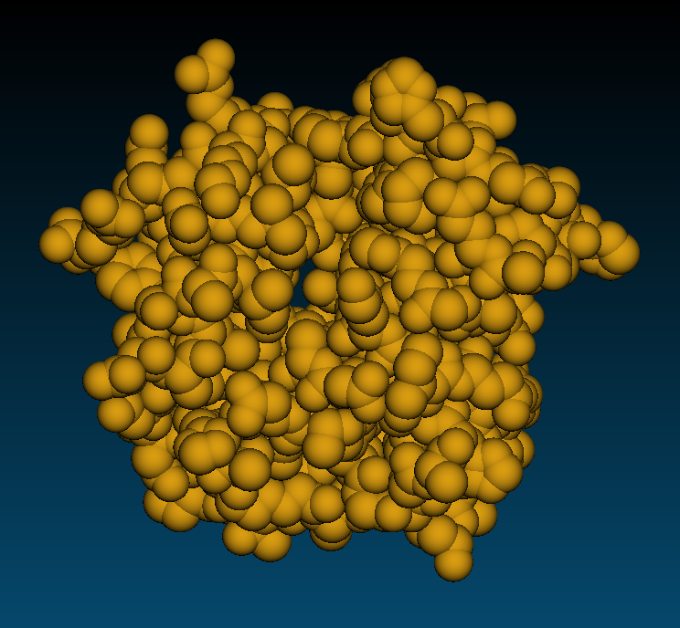
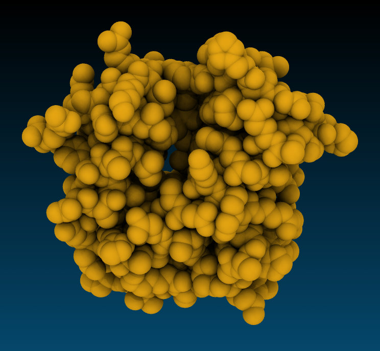
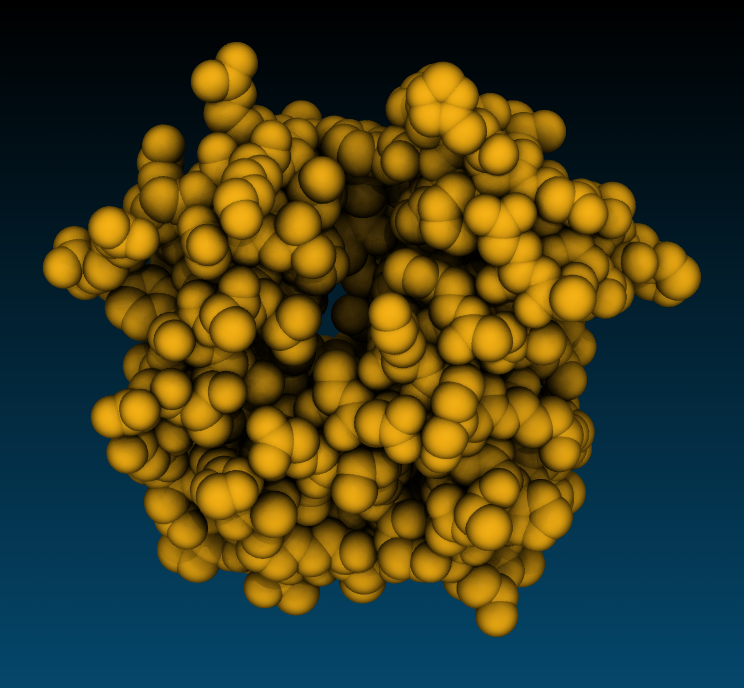
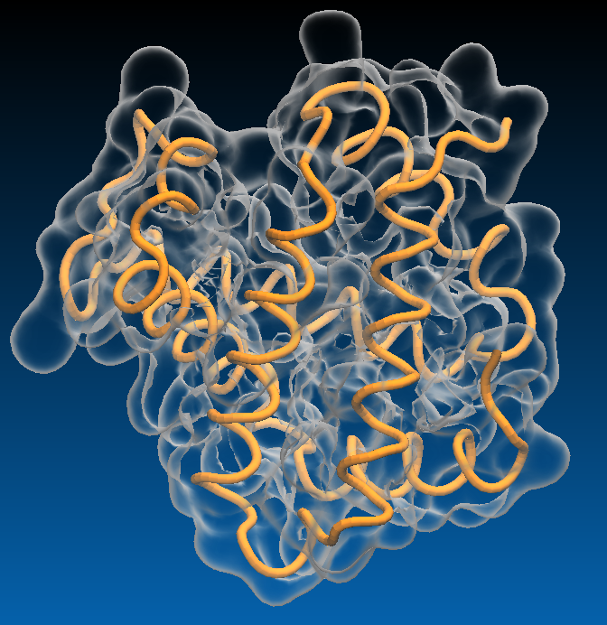
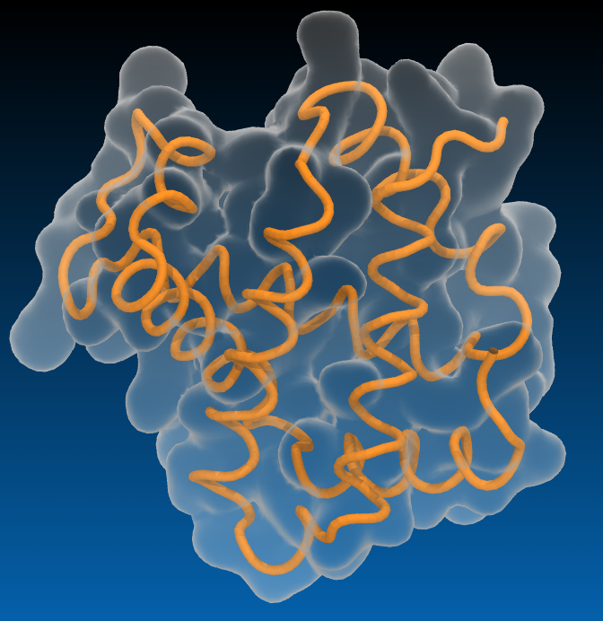

### Sequence Viewer   
`Extensions`->`Analysis`->`Sequence viewer`   
Very useful to select a residue or a group of residues in a sequence and quickly visualize them.

### RMSD Calculator    
`Extensions`->`Analysis`->`RMSD Calculator`   

The RMSD calculator works well when two molecules are composed of the same atoms, but  the alignment will fail if atom selection in the reference molecule differs from that in the target molecule. The exercise below illustrates this issue.

>## Aligning Structures and calculating RMSD 
>1. Compute RMSD of two molecules: PDB ID 1si4 and 4n7n. Use only chain A backbone atoms for the calculation. 
>2. Why using the backbone of all chain A residues for alignment causes alignment to fail? 
>3. Can you think of a way to include all backbone atoms present in both proteins in the alignment? 
>
>>## Solution
>> 1. Use the atom selection: `chain A and resid 1 to 140`, and check box `Backbone only` for both alignment and RMSD calculation, RMSD = 0.92558
>> 2. The residue 141 of 1si4 molecule has the terminal oxygen atom "OXT", while it is absent in 4n7n.
>> 3. Exclude the OXT atom from the selection: `not name OXT and chain A and resid 1 to 141` 
>>
>{: .solution}
{: .challenge}

### Align molecules using arbitrary atoms
Often you need to align molecules or molecular complexes using a subset of atoms. The simplified selection option available in RMSD calculator does not allow to select different groups of atom for different molecules. 

### RMSD Trajectory Tool
Time dependence of RMSD in a molecular dynamics simulation can be computed using the RMSD Trajectory Tool.

Go to the directory with example MD data:
~~~
cd /scratch/workshop/pdb/6N4O/simulation/sim_pmemd/4-production
~~~
{: .language-bash}

Use prmtop_nowat.parm7 and mdcrd_nowat.xtc to plot RMSD along the trajectory. Check the `plot` box to plot RMSD.

### Making input files for NAMD.
NAMD uses beta and occupancy fields of PDB files as an input for various types of calculations. 
For example, such files are used to define 
- position restraint parameters (restraint reference positions and force constant values for each atom)  
- temperature coupling parameters (temperature coupling coefficient for each atom).
- constant forces
- collective variables

~~~
mol pdbload 1si4
set selAll [atomselect 0 all]
$selAll set occupancy 0
set selBackbone [atomselect 0 "protein and backbone"]
$selBackbone set occupancy 2.0
set selHEM [atomselect 0 "resname HEM"]
$selHEM set occupancy 10.0
$selAll writepdb "constraints.pdb"
~~~
{: .vmd}

### Measuring distances between atoms vs time
Go to the directory with example MD data:
~~~
cd ~/scratch/workshop/pdb/6N4O/simulation/sim_pmemd/4-production
~~~
{: .language-bash}

This is a simulation of argonaute protein complexed with microRNA. As an example, let's measure the distance between some RNA phosphate atoms and sodium ions attached to them.

The following are some pairs you might want to consider:  
C895:P, Na+904:Na+  
C890:P, Na+1136:Na+  
C886:P, Na+1136:Na+  
A883:P, Na+966:Na+  

~~~
mol new prmtop_nowat.parm7
mol addfile mdcrd_nowat.xtc
set file [open "distance.csv" w]
puts $file "Time (ns), Distance (A)"
set nf [molinfo top get numframes]
set sel1 [atomselect top "resid 895 and name P"]
set sel2 [atomselect top "resid 904"]
set bondList [measure bond "[$sel1 get index] [$sel2 get index]" first 0 last $nf]
for {set i 0} {$i < $nf} {incr i} {
   set dist [lindex $bondList $i]
   set time [expr $i/1000.0]  
   puts $file "$time, $dist" 
   }
close $file 
~~~
{: .vmd}

#### Plotting data with Gnuplot
Start Gnuplot by typing gnuplot. Then it gnuplot command prompt enter the following commands:

~~~
set xlabel "Time (ns)"
set ylabel "Distance, (A)"
plot "dist_P-Na+.csv"  with lines
~~~

#### Measuring distances between groups of atoms

Measure distance between centers of mass of protein and nucleic acids
1. `measure center <selection>` - compute coordinates of the center of mass 
2. `vecsub <vec2> <vec1>` - find vector connecting two centers of mass 
2. `veclength <vector>` - compute distance  

~~~
mol new prmtop_nowat.parm7
mol addfile mdcrd_nowat.xtc waitfor all
set file [open "distance.csv" w]
puts $file "Time (ns), Distance (A)"
set nf [molinfo top get numframes]
set prot [atomselect top "noh protein"]
set nucl [atomselect top "noh nucleic"]

for {set i 0} {$i < $nf} {incr i} {
   $prot frame $i
   $nucl frame $i  
   set prot_center [measure center $prot weight mass]
   set nucl_center [measure center $nucl weight mass]   
   set dist [veclength [vecsub $prot_center $nucl_center]]
   set time [expr $i/1000.0]  
   puts $file "$time, $dist" 
   }
close $file 
~~~
{: .vmd}

https://www.concordia.ca/content/dam/artsci/research/cermm/docs/workshops/VMDworkshop.pdf

### Making movies

#### Movie maker
The `Movie Maker` extension offers several types of animations. You can make a movie of rotation of rocking a static structure, or animate a trajectory with an optional viewpoint rocking. The available compression algorithm is also a very basic quality mpeg-2 encoder optimized for speed on a single computer.  

~~~
module load vmd ffmpeg
vmd
~~~
{: .language-bash}

- `Extensions` -> `Visualization` -> `Movie Maker`
- `Movie settings` -> `Rotation about Y axis`
- `Format` -> `MPEG2(ffmpeg)`
- Optionally `Set working directory` 
- In the `Movie durations (seconds)` box enter 10
- Press `Make movie`

### Making movies via TCL scripts

Options in movie maker are fairly limited. For example you can not make a movie zooming at the molecule while it is advancing in time.

With a custom animation script you have full control of camera movements and special effects such as adding glow lights to some atoms, drawing geometrical figures, dynamic slicing volume data, etc. 

Much better image rendering can be done in a reasonable time on an HPC cluster. Typically you would use VMD to write scene description files of every trajectory frame for subsequent rendering with a ray tracing engine such as Tachyon. Then you would submit a script for rendering multiple frames in parallel on hundreds of CPU's. Then you would encode all frames in a movie with ffmpeg. Much better compression algorithms such as H.265/HEVC or Google VP9 with much higher quality settings can be used to encode an animation with `ffmpeg`.

Exercise:
Create a movie showing the diffusion of several Na+ ions. It is good to pick residues 904, 996, and 1136 because they display association-dissociation dynamics.

~~~
proc makemovie { } {
for { set i 0 } { $i < [molinfo top get numframes] } { incr i } {
   animate goto $i 
   puts "Rendering frame $i"
   display update
   render snapshot tmp/$i.ppm
   }
}
~~~
{: .vmd}

### APBS electrostatics
Surfaces, isosurfaces, and other representations can be colored by electrostatic potential. Any other volumetric properties such as density can be also used for coloring. Electrostatic potential calculations in VMD are done with APBS - Adaptive Poisson-Boltzmann Solver. APBS solves the equations of continuum electrostatics for biomolecular systems. This program must be made available to VMD by loading the `apbs` module. Below are the commands to make .pqr file from AMBER topology and restart files. These files are available in the workshop data. We will go though all the steps of system preparation later. 

APBS requires a PDB file with atomic partial charges and radii as an input. Such file can be easily prepared from a simulation topology file. 

~~~
module load vmd apbs ambertools
source $EBROOTAMBERTOOLS/amber.sh
cd ~/scratch/workshop/pdb/6N4O/simulation/setup
cpptraj prmtop.parm7
~~~
{: .language-bash}

~~~
trajin inpcrd.rst7
strip !(:860-898)
trajout nucleic.pqr pdb dumpq
go
~~~
{: .cpptraj}

VMD
1. Load .pqr file
2. Representation Surf or QuickSurf 
3. `Extensions` -> `Analysis` -> `APBS electrostatics` ->  `Run APBS`
4. When prompted `Load ABBS into top molecule`
5. Select coloring method `Volume`
6. Adjust `Color scale data range` in the `Trajectory` tab. Try [-50 50]
7. Electrostatic potential map pot.dx is saved in /tmp/apbs.xxxxx

To compute electrostatic potential we need a PQR file which is basically PDB file with charges and radii. This file can be made using PDB2PQR web server or utility programs from AMBERTOOLS module.

Considering that we will be learning AMBER, let's use AMBERTOOLS. There are two steps involved in creating PQR files from PDB files.

1. Using a force field and a pdb file, create a topology file
   ~~~
   module load gcc ambertools
   tleap -f leaprc.RNA.OL3
   ~~~
   {: .language-bash}
   ~~~
   rna=loadpdb bcl2-1.pdb
   saveamberparm rna bcl2-1.parm7 bcl2-1.rst7
   quit 
   ~~~
   {: .leap}
2. Utilizing the PDB and the topology file, create the PQR file.
   ~~~
   cpptraj bcl2-1.parm7
   ~~~
   {: .language-bash}
   ~~~
   trajin bcl2-1.rst7
   trajout  bcl2-1.pqr pdb dumpq
   go
   quit
   ~~~
   {: .leap}

#### Higher quality rendering
VMD is designed to generate images very fast to maximize interactivity, so in interactive mode rendering is optimized for speed and VMD does not use computationally intensive  photorealistic rendering techniques. If you want a very high definition picture, or a picture with photorealistic rendering of shadows or transparent surfaces you need to use a ray tracing engine. Instead of producing high quality images directly, VMD writes scene description files which can be used as input to several ray tracing programs. In this tutorial, you will learn how to make an image using Tachyon ray-tracing engine through VMD’s graphical interface. VMD ships with Tachyon for producing high quality images.

Because Tachyon simulates light interaction with virtual objects, it handles shadows realistically, and representations that have crevices appear to have three-dimensional depth.

The most important Display settings enabling ray tracing are `Shadows` and `Amb. Occl.`. They both should be turned on. Materials suitable for Tachyon are diffuse, AoChalky, AoShiny, AoEdgy. 

|-----------------------------|-------------------------|---------------------------------------|
|:---------------------------:|:-----------------------:|:-------------------------------------:|
|  Snapshot        |  Tachyon, AoChalky |  Tachyon, AoEdgy  |
|  Snapshot  |  Tachyon, BlownGlass,  \-\-trans_max_surfaces 1| |

### References
[VMD Introductory tutorial](https://doi.org/10.1002/0471250953.bi0507s24)



proc trajfit { } {
#FIT FRAMES
set ref [atomselect top "backbone and resid 5 to 100" frame 0]
set sel [atomselect top "backbone and resid 5 to 100"]
set all [atomselect top "all" ]
set n [molinfo top get numframes]

proc makemovie { } {
set steps  840; # number of frames per complete sequence
set yangle 0.2; # Y-axis arc angle to sweep over
set xangle 0.1; # X-axis arc angle to sweep over (yangle / 2.0 or so is good)

set startframe 0; # first frame to render
set nframes 2200; # number of frames to render
set n [molinfo top get numframes]
set nt [expr ($n - $startframe)]
 for { set i $nt } { $i >= ($nt - $nframes) } { incr i -1 } {
    set j [expr ($n-$i+1)]
    animate goto $i
    puts "Frame $j"

    set pipcnt [expr 6.28 * ($j / ($steps * 1.0))] 
    rotate x by [expr $xangle * sin($pipcnt * 2.0)]
    rotate y by [expr $yangle * sin($pipcnt)]

    display update
  ::GlowLights::reset
  set sel [atomselect top "resname CA"]
  set pos [$sel get {x y z}]
  ::GlowLights::new_light [lindex $pos 0] yellow { 0.04 0.4 0.8 } 0.1 
  ::GlowLights::new_light [lindex $pos 1] yellow { 0.04 0.4 0.8 } 0.1 
  ::GlowLights::new_light [lindex $pos 2] yellow { 0.04 0.4 0.8 } 0.1 
  ::GlowLights::new_light [lindex $pos 3] yellow { 0.04 0.4 0.8 } 0.1 
  ::GlowLights::draw_lights
  ::GlowLights::render_scene tmp/$j.dat tmp/$j.tga
#    render TachyonLOSPRayInternal tmp/$j.ppm
#    render snapshot tmp/$j.ppm

  }
}

- MPEG-2 I-frame only Highest Quality Encoding
~~~
ffmpeg -i %d.ppm -vcodec mpeg2video -pix_fmt yuv420p -q:v 1 -an  movie.m2v
~~~
{: .language-bash}

- H.264 I-frame only Highest Quality Encoding
~~~
ffmpeg -i %d.ppm -vcodec libx264 -pix_fmt yuv420p -crf 18 -s 1080x720 -preset veryslow movie.mp4
~~~
{: .language-bash}

